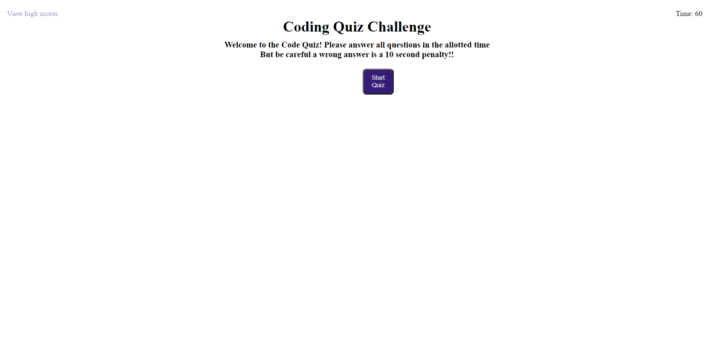

# Dynamic Code-Quiz
This project is a dynamic interactive quiz on coding knowledege. The quiz is timed and with each incorrect answer 10 seconds is removed from the timer when you reach the end of the game the remaining time is your score!! You will be able to save your initials and score at the end of the game. Have fun!!

## Languages and tools used in project
1. HTML5
2. CSS3
3. JavaScript (Main Focus)
4. DOM Manipulation

### Application can be deployed here: https://joshcarter8400.github.io/Code-Quiz/

